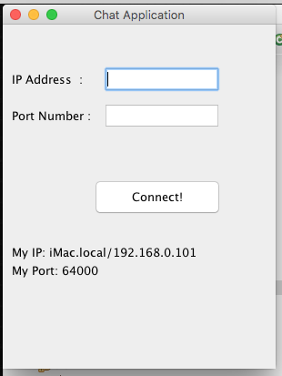
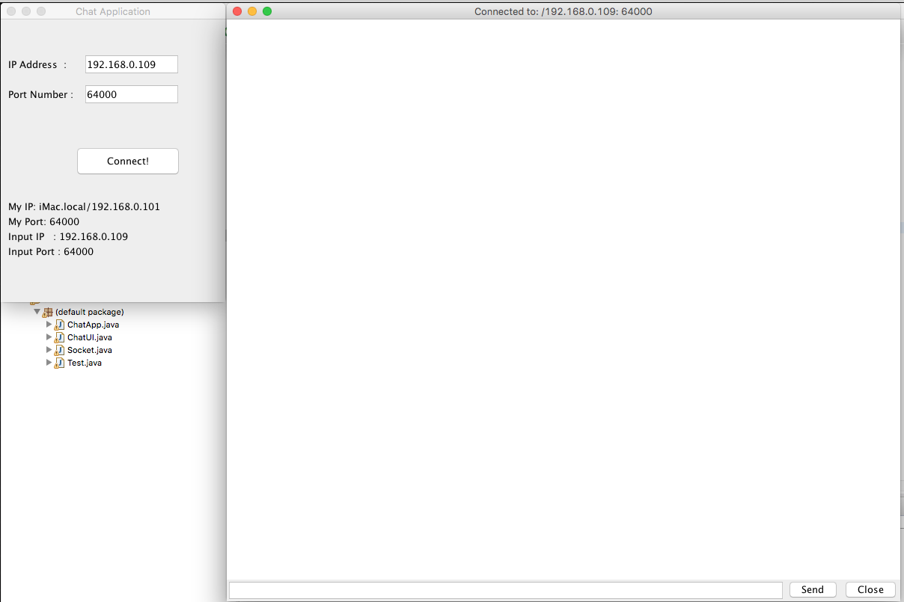
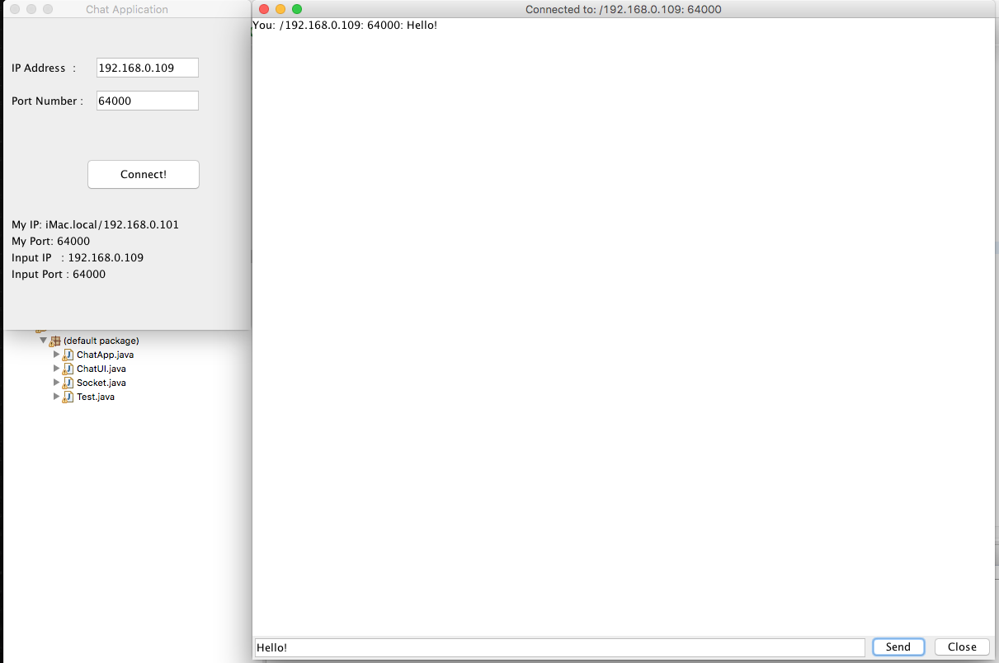

### *Name: Chanyu C.*

### Class Name: Computer Science - Network Class
### Program Name: Chat Application

### Description: 
``` 
This application's formal name is called UDP Socket.
A user can connect to another user with their IP address
and the port number. When it's connected, they'll get 
a texting screen to receive or send messages to each other.
```

### 1st - Initial GUI Screen:
<a href = "pic1.png">

### 2nd - Connected to Input:
<a href = "pic2.png">

### 3rd - Message has been sent:
<a href = "pic3.png">

### 4th - Message has been received:
<a href = "pic4.png">