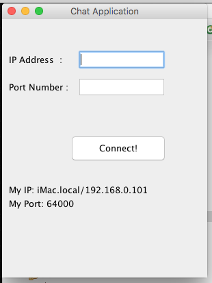
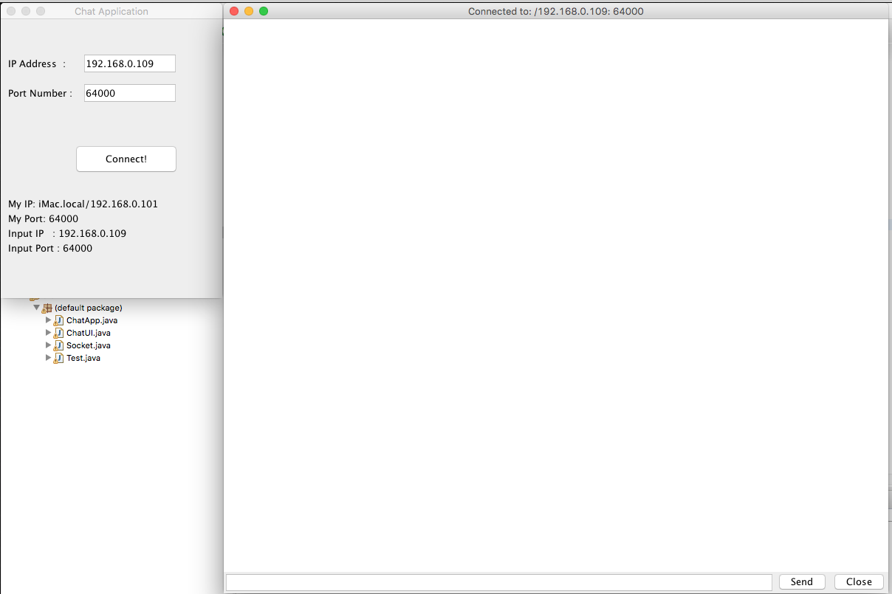
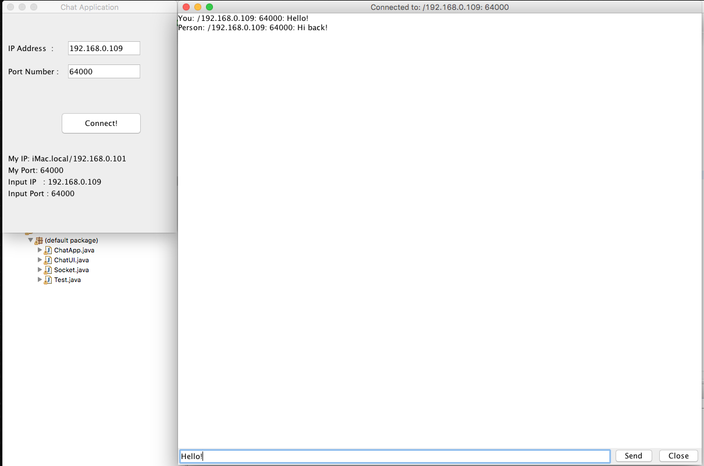
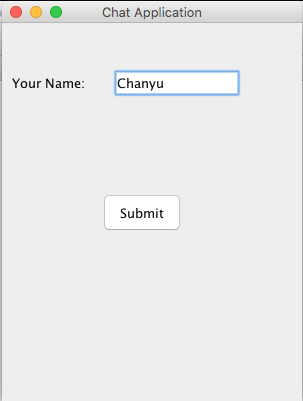
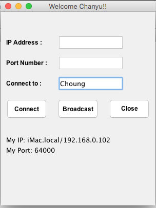
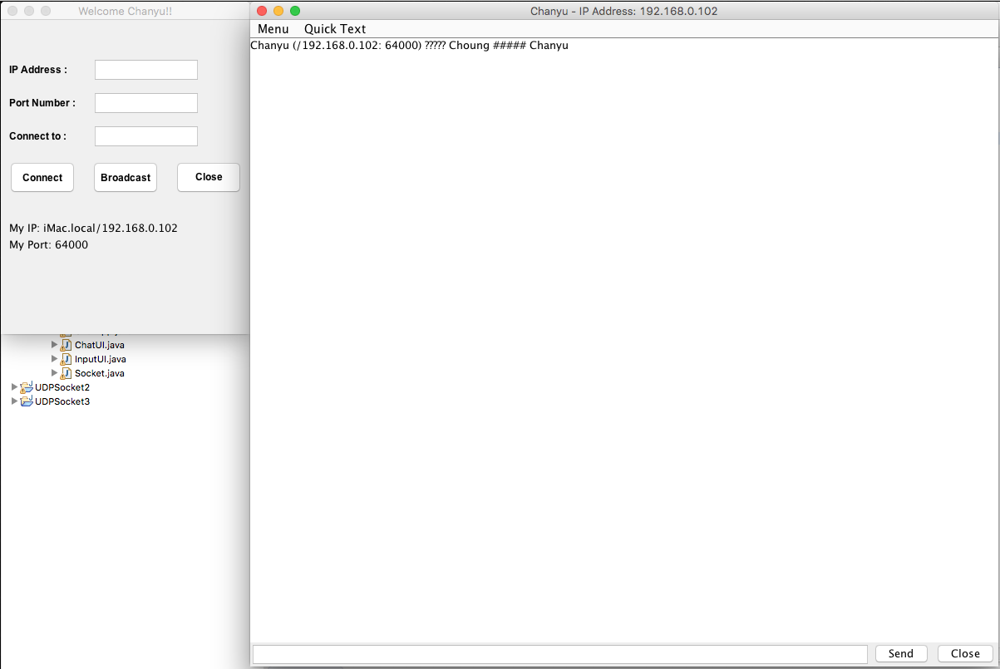

### *Name: Chanyu C.*

### Class Name: Computer Science - Network Class
### Program Name: Chat Application HW6

### Description: 
``` 
This application's formal name is called UDP Socket.
A user can connect to another user with their IP address
and the port number. When it's connected, they'll get 
a texting screen to receive or send messages to each other.
```

### 1st - Initial GUI Screen:
<a href = "PICS/pic1.png">

### 2nd - Connected to Input:
<a href = "PICS/pic2.png">

### 3rd - Message has been sent:
<a href = "PICS/pic3.png">

### 4th - Message has been received:
<a href = "PICS/pic4.png">


### Class Name: Computer Science - Network Class
### Program Name: Chat Application HW7

### Description: 
``` 
This is an extension of ChatApplication HW6.
It's capable of broadcasting to a local network
and connect to the person via their username.
It dissects the datagram and sort it out to 
determine if it's for you or another machine. 
```

### 1st - Picking Username:
<a href = "PICS/pic5.png">

### 2nd - Broadcast via Username:
<a href = "PICS/pic6.png">

### 3rd - Broadcast has been sent:
<a href = "PICS/pic7.png">

### 4th - Broadcast has been received:
<a href = "PICS/pic8.png">